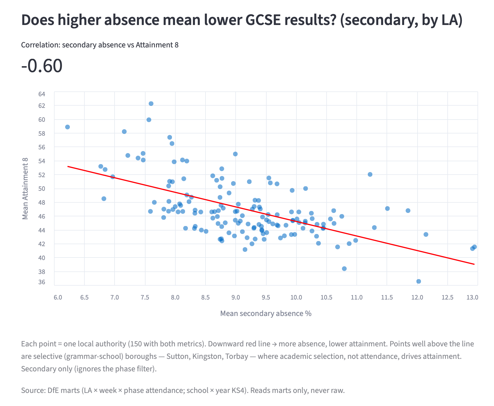
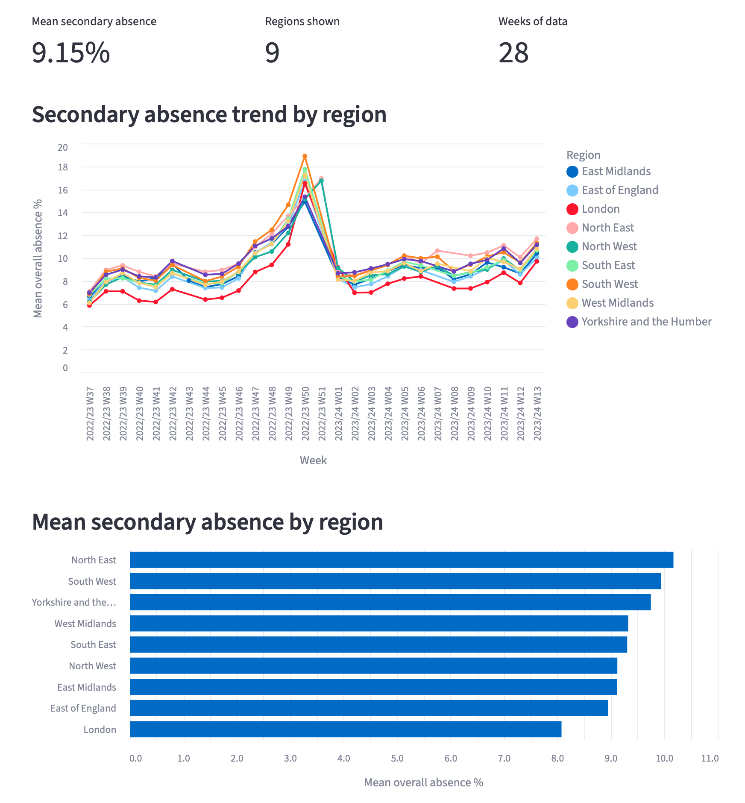
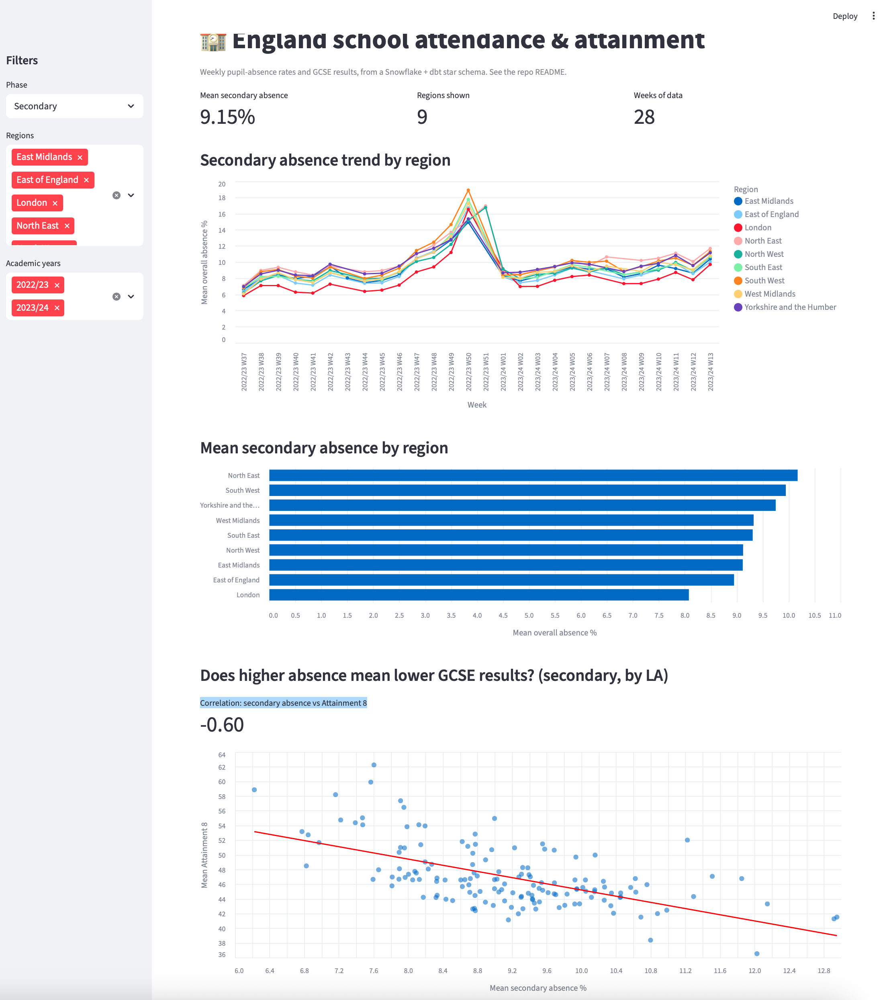

# England Schools — Attendance & Attainment

**Across England's local authorities, secondary-school pupil absence and GCSE attainment move together.** LAs in the *lowest*-absence quartile average **51.1** Attainment 8 points; those in the *highest*-absence quartile average just **44.6** — a 6.5-point gap, with an overall correlation of **−0.60**. This repo is a small **Snowflake + dbt** pipeline that lands three public DfE datasets (school register, weekly attendance, KS4 results), models them into a tested star schema, and surfaces that relationship. It was built **AI-first** — spec-first, agentic execution, every change through a reviewed PR.

**Stack:** Snowflake · dbt · DuckDB · Streamlit · Python · Altair

> See [SPEC.md](SPEC.md) for the spec/contract.

## Pipeline

```
DfE CSVs → Snowflake RAW (stage + COPY INTO)
  → dbt staging (stg_, filtered + cast + tested)
  → dbt marts: dim_school + fct_attendance_weekly + fct_ks4_results
  → insight queries (below) + Streamlit dashboard
```

Two facts at two grains, conformed on `dim_school`: **`fct_ks4_results`** (school × year, clean FK to `dim_school`) and **`fct_attendance_weekly`** (LA × week × phase — attendance is only published at LA grain, the central modelling constraint).

## Insights

### 1. Absence tracks attainment (the headline)
Secondary absence vs GCSE Attainment 8, aggregated to LA level (149 LAs). **Correlation −0.60.**

| LA absence quartile | Mean absence % | Mean Attainment 8 | LAs |
|---|---|---|---|
| 1 — lowest absence | 7.73 | **51.1** | 38 |
| 2 | 8.76 | 46.8 | 37 |
| 3 | 9.46 | 45.4 | 37 |
| 4 — highest absence | 10.69 | **44.6** | 37 |

A clean monotonic gradient: more absence, lower attainment. (Association, not causation — both track deprivation, and selective boroughs break the pattern; see caveats.)

### 2. A regional gradient
Mean secondary absence by region:

| Region | Mean secondary absence % | LAs |
|---|---|---|
| North East | 10.17 | 12 |
| South West | 9.94 | 14 |
| Yorkshire and the Humber | 9.75 | 15 |
| West Midlands | 9.33 | 14 |
| South East | 9.31 | 19 |
| East Midlands | 9.12 | 10 |
| North West | 9.12 | 22 |
| East of England | 8.95 | 11 |
| **London** | **8.08** | 32 |

London has the lowest secondary absence in the country — the "London effect" visible in the data.

### 3. Headline figures
- **National secondary absence:** 9.15%.
- **LA mean Attainment 8 spread:** 36.5 → 62.2 — a wide gap between areas.

SQL for these lives in [`analyses/`](analyses/) (dbt analyses, referencing the marts).

## Dashboard

A **Streamlit** app over the marts ([`app/dashboard.py`](app/dashboard.py)) — headline metrics, an absence trend by region × phase, a regional ranking, the cross-fact scatter, a searchable school-level GCSE attainment table (every school with 2024/25 KS4 results, named — Attainment 8 / EBacc / %grade-5), and a two-school side-by-side comparison. Organised into **tabs** (Ask · Attendance · Attainment · Compare) and **mobile-friendly** (no sidebar).

**AI question box:** type a question in plain English → an LLM writes SQL against the marts → the app **validates it** (SELECT-only, single-statement, mart-scoped, auto-LIMIT), **shows the SQL**, then runs it. Provider-swappable (`AI_PROVIDER` = `groq` / `gemini` / `anthropic` / `openai`; set the matching API key in `.env` locally, or **Streamlit Secrets** when hosted). **Groq** has a genuinely free tier (no card) and is the default. Read-only hardening via [`snowflake/setup_reader.sql`](snowflake/setup_reader.sql) + `SNOWFLAKE_AI_ROLE=READER`.



*Secondary absence vs Attainment 8 by LA — the −0.60 relationship, with selective boroughs (Sutton, Kingston, Torbay) sitting above the trend line.*



*Weekly secondary absence by region — London consistently lowest.*



## Method & caveats (read before quoting the numbers)
- **Grain:** attendance is LA × week × phase (DfE doesn't publish it per school); KS4 is per school. The cross-fact insight joins them at **LA level** for **secondary** schools (Secondary + All-through).
- **Year mismatch:** GCSE/KS4 results are **2024/25**; the loaded weekly attendance covers **2022/23–2023/24**. So the cross-fact insight pairs slightly different years — indicative (deprivation drives both and moves slowly), but not the same cohort. Refreshing attendance to the latest release is future work.
- Absence figures are the **unweighted mean of weekly percentages** per LA (not session-weighted) — fine for ranking, not an official statistic.
- **Negligible-reporting weeks dropped:** `stg_attendance` excludes LA-weeks with `possible_sessions < 1000` — a near-empty submission had logged 100% absence on 20 sessions, spiking a whole region in the dashboard. (Removed 357 such rows; the spike is what flagged it — and it underlines that a session-*weighted* mean would be the fuller fix.)
- **Progress 8 is excluded** — DfE doesn't publish it for 2024/25 (COVID cohort, no KS2 baseline). Attainment 8 is the attainment measure.
- **Outliers are explainable, not noise:** a few LAs sit well above the absence–attainment trend — **selective (grammar-school) boroughs** (Sutton, Kingston, Torbay), where academic selection drives attainment. The **Isles of Scilly** (one school, suppressed secondary absence) is excluded from the scatter.
- **Two documented data-quality warnings** (dbt `relationships` tests, `severity: warn`): 119 schools had 2024/25 results but have since closed (absent from the current-open dimension); LA `909` (Cumbria) was abolished in 2023, so its attendance rows don't join — surfaces as the "(unmapped)" region.

## Run it
```bash
python -m venv .venv && source .venv/bin/activate
pip install -r requirements-dev.txt     # full build deps (dbt, snowflake, duckdb)
cp .env.example .env                     # set SNOWFLAKE_ACCOUNT + GROQ_API_KEY
python ingest/load.py                    # land raw into Snowflake
dbt build                                # staging + marts + tests
python ingest/export_marts.py            # export marts -> app/marts.duckdb (for deploy)
streamlit run app/dashboard.py           # local = live Snowflake; DATA_BACKEND=duckdb to test deploy path
```

## Deploy
The dashboard is **decoupled from Snowflake for hosting**: `ingest/export_marts.py` exports the marts to a small read-only **`app/marts.duckdb`**, and the app reads that when no Snowflake is configured (`app/db.py` picks DuckDB unless `SNOWFLAKE_ACCOUNT` is set). That's a **serving layer in front of the warehouse** — no DB credential at the edge, and the hosted demo needs no live warehouse connection.

On **Streamlit Community Cloud**: point it at this repo with entry `app/dashboard.py`; it installs the lean `requirements.txt` (no Snowflake/dbt) and serves the bundled DuckDB. Add **`GROQ_API_KEY`** in the app's **Secrets** to enable the AI box. Local dev still hits live Snowflake via `.env`.

_Built AI-first: spec-first, agentic execution, every change through a reviewed PR._
